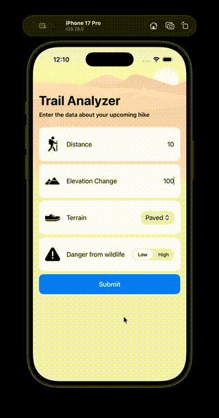

# ml_linear_regression
Create an ML Model and use it within an app.

1. Train a Core ML model with Xcode -> Open Developer Tool -> Create ML
2. Choose **Tabular Regression** for this app's situation because the predicted/outputted value is a **continuous** value. If instead it was predicted value was instead a *category/discrete* value, then use **Tabular Classification** instead.
3. Use the model in your app: feed the model inputs to predict the output.

